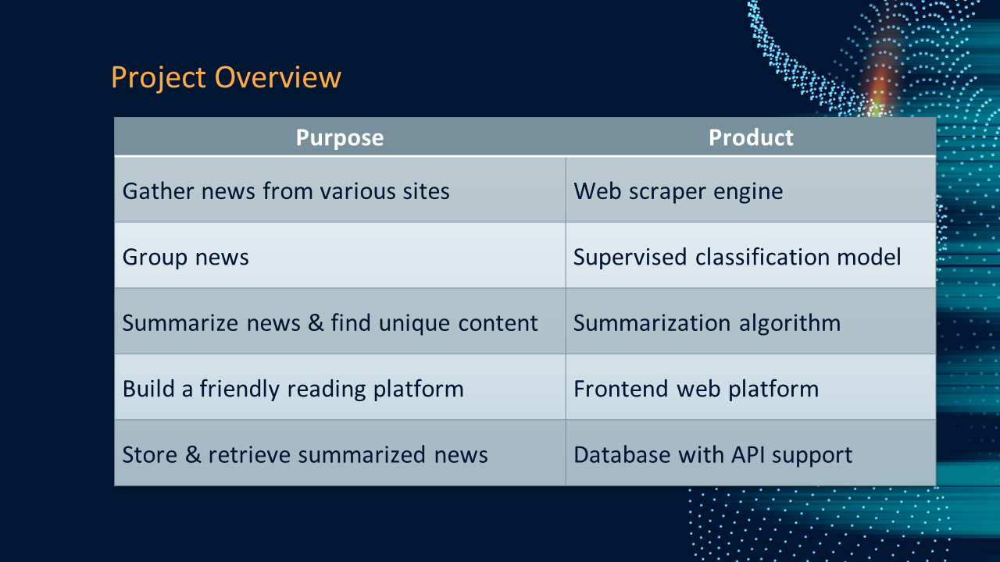
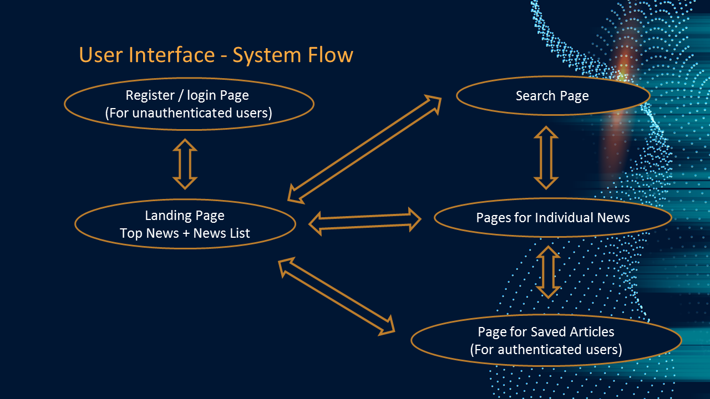
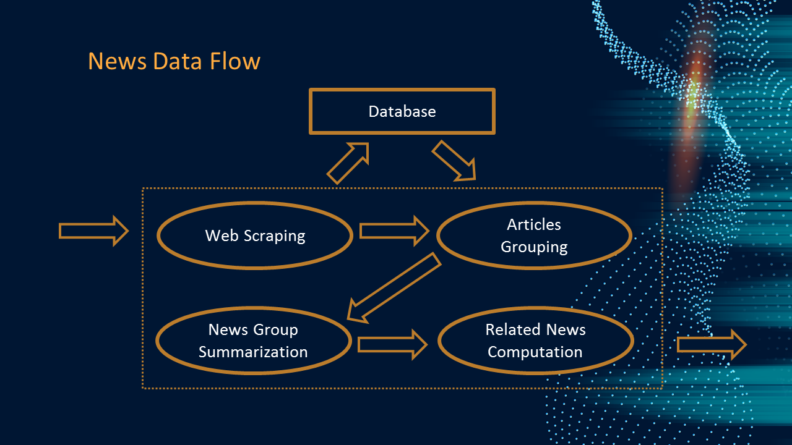
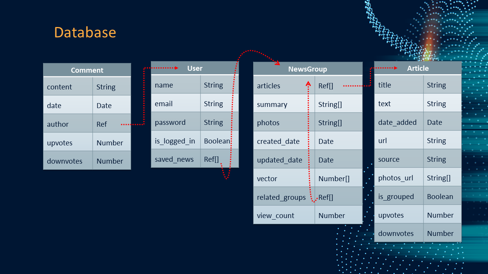

[](https://yarnpkg.com/)
[](https://pypi.org/project/pip)
[](https://www.anaconda.com/)
[](https://colab.research.google.com/)
[](https://vercel.com/)
[](https://www.heroku.com/)
[](https://www.python.org/)
[](https://nodejs.org/en/)
[](https://sass-lang.com/)
[](https://www.selenium.dev/)
[](https://www.tensorflow.org/)
[](https://keras.io/)
[](https://expressjs.com/)
[](https://vuejs.org/)
[](https://nuxtjs.org/)
[](https://www.mongodb.com/)
[](https://www.nltk.org/)
[](https://spacy.io/)
[](https://www.crummy.com/software/BeautifulSoup/bs4/doc/)
[](https://pypi.org/project/newspaper3k/)
[](https://swiperjs.com/)
[](https://momentjs.com/)


Many thanks to our advisor, Dr. Cecia Chan, and my passionate groupmates, [Martin](https://github.com/lhfmartin), [Anson](https://github.com/Anson-To), and [Klaus](https://github.com/ChauShunWai), for the successful delivery of this project.

---

## Table of contents
* [Overview](#overview)
* [AI + Scraper](#ai--scraper)
  * [Getting Started](#getting-started)
  * [Sequential Diagrams](#sequential-diagrams)
      * [News Scraping](#news-scraping)
      * [News Processing](#news-processing)
* [API](#api)
  * [Getting Started](#getting-started)
  * [Testing](#testing)
  * [Documentation](#documentation)
* [Database](#database)
* [Frontend](#frontend)
  * [Getting Started](#getting-started)
  * [Testing](#testing)

---

## Overview

Our project can be briefly summarized by the table below.



Frontend web component is built for displaying the computed news result,



and data are scraped and computed in backend.



Of course the development of database is essential along the way.



More details about this project can be found in our final delivery.
- [Presentation Slides](assets/final-presentation.pptx)
- [Report](assets/final-report.pdf)

See [this link](https://ceci1.vercel.app) for an experimental deployment of the project. Interested visitors can follow the instructions below to start your local development.

---

## AI + Scraper

### Getting Started

It is understandable that not everyone owns a machine with powerful hardwares. In this case, using **Google Colab** to run the codes in this repository might be your way to go. Just visit our [colab notebook](./colab_driver.ipynb) and have some fun with it. 

Alternatively you may install the dependencies via conda (with [requirements.txt](./requirements.txt)) or via pip (with [requirements_pip.txt](./requirements_pip.txt)), and you may still wanna refer to the step 4 in the [colab notebook](./colab_driver.ipynb) for the exact commands that need to be executed.

### Sequential Diagrams

Below gives a rough sketch on backend data flow.

#### News Scraping


```
title News Scraping

participant News AI
participant External News Source
database News Database

News AI->External News Source: Request news on reqular interval
External News Source-->News AI: Return news
News AI->News Database: Save news
```

#### News Processing


```
title News Processing

participant News AI
database News Database

News AI->News Database: Request news from past day
News Database-->News AI: Return news
box over News AI: Assign a group for newly downloaded news
News AI->News Database: Save group ids for newly downloaded news
box over News AI: Summarization for news groups
News AI->News Database: Save group summary
```

---

## API

### Getting Started
0. Install MongoDB 
1. Install dependencies with `yarn install`
2. Start the server with `yarn start`
3. The API is now served at port 3000

### Testing
Run `yarn test`. This part in terms of code coverage is largely incomplete, due to time limit.

### Documentation
Most logic inside the API endpoints are quite self-explainatory, but it can for sure be made better.

---

## Database

- Schema is displayed in the [overview](#overview) section. 
- Inside the [`fyp-db/`](fyp-db/) folder, there are also some precomputed data (stored in a [`temp/`](fyp-db/temp/) that can be used for model training or for demos trials in the [`fyp-ai/`](fyp-ai/) folder.

---

## Frontend

### Getting Started

```bash
# install dependencies
$ yarn install

# serve with hot reload at localhost:3000
$ yarn dev

# build for production and launch server
$ yarn build
$ yarn start

# generate static project
$ yarn generate
```

For detailed explanation on how things work, check out [Nuxt.js docs](https://nuxtjs.org).

### Testing
Run `yarn test`. This part in terms of code coverage is largely incomplete, due to time limit.
